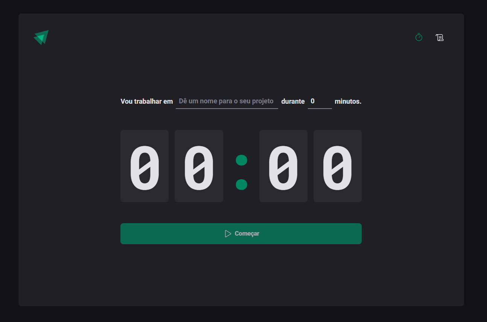

<h1 align="center">
  <a>
    ignite-timer
  </a>
</h1>

<b>ignite timer</b> foi desenvolvido com React JS, um pomodoro com o objetivo de aumentar sua produtividade e foco nas tarefas, reduzir a ansiedade e entre outros benefícios...

   

  

  

  

  

  

Nesse projeto criamos um timer onde definimos um nome para ele, junto ao estados("em andamento", "interrompido" e "concluído"), fazemos a listagem e a persistência de dados em local storage. Conheci a biblioteca "date-fns" para lidar com datas e horários, utilizamos o "React Hook Form" para lidar com o formulário, o hook useReducer do React para centralizar as alterações de um estado um pouco complexo e fizemos a estilização com o styled-components

